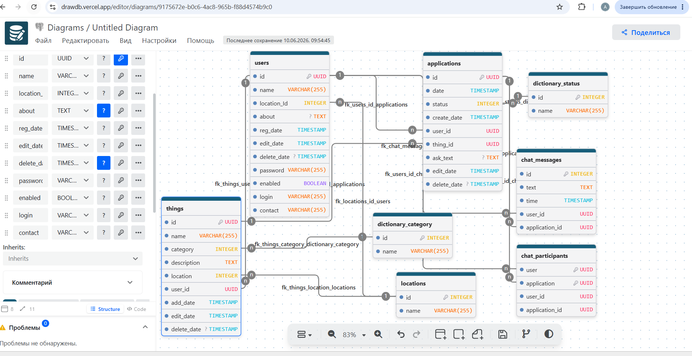

# Бекенд часть проекта SecondShelf

SecondShelf - проект (на подобии Авито), смысл которого
обмениваться вещами, но без оплаты.

Тут вы можете найти клиентскую часть:
[андроид-приложение](https://github.com/AlexanderKott/SecondShelfMobileApp)
Так же, там есть более детальное описание и ссылка на спеку.

Так выглядит схема БД:

Скачать схему можно ["здесь"](readme/db_dump.sql)

Здесь я составил список всех запросов к БД которые будут использованы в
при разработке функционала. ["запросы"](readme/db_queries.txt)

Стэк: Spring Boot, Spring Data, Spring Security, JWT tokens

Планы:
Аутентификацию планирую сделать OAuth (Вконтакте), пока в работе